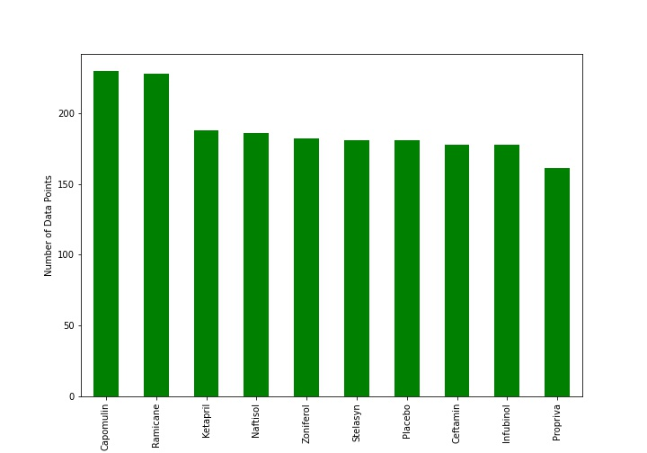
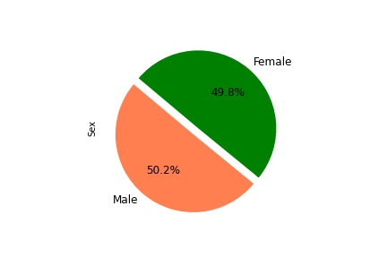
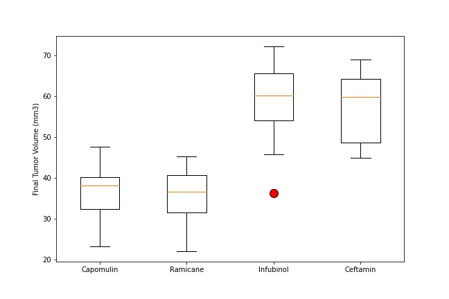
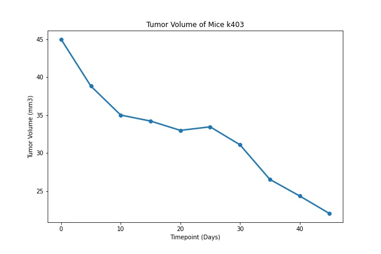
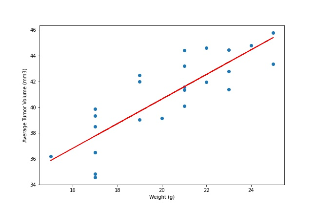

# The Power of Plots

## Background

Pymaceuticals Inc., is a burgeoning pharmaceutical company, specializing in anti-cancer pharmaceuticals. In its most recent efforts, it began screening for potential treatments for squamous cell carcinoma (SCC), a commonly occurring form of skin cancer.  Their most recent animal study includes data where 250 mice identified with SCC tumor growth were treated through a variety of drug regimens. Over the course of 45 days, the tumor development was observed and measured.The purpose of this study was to compare the performance of Pymaceuticals' drug of interest, Capomulin, versus the other treatment regimens. 

### Visualizations

### Conclusions

* Of the four drug regimens (Capomulin, Ramicane, Infubinol, and Ceftamin) Capomulin and Ramicane seem to be more effective for treating the mice with SCC tumor growth based on the final tumor volume.

* The mice with the tumor growth, that are included in the study seem to be pretty equally distributed in terms of gender. It would be interesting to see if gender impacts the efficacy of the drug regimen.

* As time progresses, the tumor volume in mice seems to shrink down consistently with the use of Capomulin regimen.

* A high R-squared of 0.84 suggests a strong correlation between the mouse weight and the average tumor volume indicating the weight of the mice being treated also has an impact on the efficacy of the drug.

* More data such as tumor development beyond the 45-day period, starting tumor volumes in the mice being treated would help in determining the efficacy of the drug regimens.

